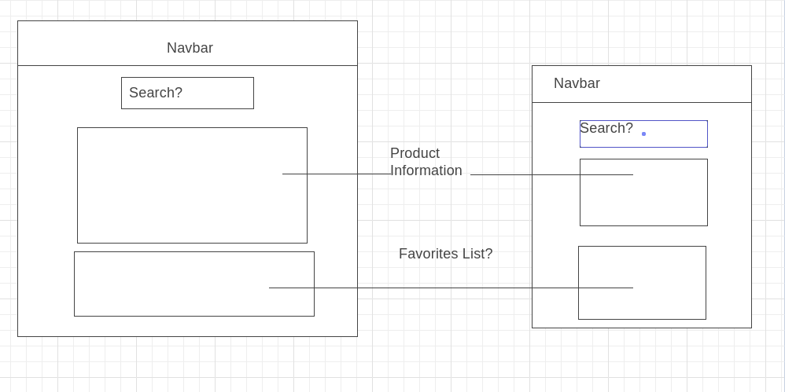
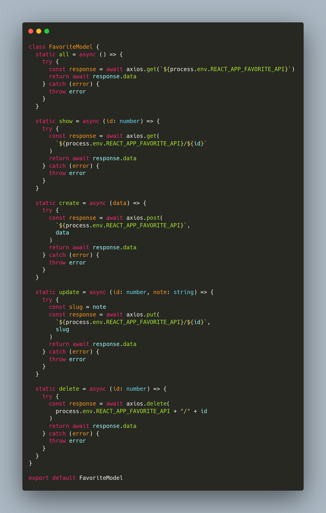

# Coinbase Apprenticeship Project: Copper Prop

## What is Copper Prop?

Beyond a silly play on words, my original vision for Copper Prop would be a Crypto-Comparison-Application. You could leverage market information of cryptocurrencies via the Coinbase API to get current stats. See a crypto that catches your eye? Save it. Eventually, I envisioned the ability to be able to compare your favorites against others, or even against its own historical data.

The back end of copper prop is written in TypeScript and Express, utilizing TypeORM, and PostgreSQL to save favorites with a note (essentially the jumping off point for how I wanted to compare). The front end was also written in React and TypeScript, utilizing the MUI library for design. The main MUI components levereged were: Select, Appbar, Grid, IconButton, Paper, and Typography, with a few additional icons.

Beyond the practical applications of the application in terms of CryptoCurrency, it was also an incredible refresher into modern React, but also a venture into TypeScript. I realized that there were many things that I had forgotten, but luckily through the project I remembered much and learned much more. I hope to continue this app, and polish it even further.

## ERD and WireFrames

The original vision was to have a user being able to log in and have their own favorites table. Unfortunately, given the time constraints, being a caregiver, the user table was scraped in favor of practicality. Originally, a user could have many favorites. The API of copperprop.herokuapp.com supports all functionality for CRUD operations.

```
,------------------.
|       User       |
|------------------|
| id | name | email|
|----|------|------|>----.
|____|______|______|     |
                        /|\
,----------------------------------.
|             Favorites            |
|----------------------------------|
| id: int | cryptoName: s| note: s |
|---------|--------------|---------|
| 1       | BTC          | Wish I got in early
'----------------------------------'

CREATE - add a favorite
READ - retrieve list of favorites
UPDATE - update the note
DESTROY - delete a favorite
```

Initial Wire Frame Mock Up


## Architectural Pattern: MVC

The front end of the application was designed with the Model-View-Controller design pattern in mind, as well as the back end. The models are the backbone of the application, because they are the ones that made the API calls to update the information, while the views are rendered by the components (controllers). I attempted to work as closely as possible to the MVC design patterns that were taught to me at my software engineering bootcamp.

## APIs

### Internal

The internal favorite API is what drives the CRUD capability of the app. They can be checked internally on local host after following the installation instructions below, or they can be tested on the live server. However, if it is being tested on the live server it is suggested to attempt to ping it via Postman with a simple GET request as shown below, because it runs on Heroku and the Dyno might be asleep.

Note: The API requests are done with curl which defaults to GET

```bash
curl copperprop.herokuapp.com/api/v1/health
```

```json
{ "sanityCheck": "sane" }
```

Once we have queried the server status to see if it is running, we can query the favorites ALL end point:

```bash
curl copperprop.herokuapp.com/api/v1/favorite
```

```json
[
  {
    "cryptoName": "ETH-USD",
    "note": "my friend mines this",
    "id": 1,
    "createdAt": "2021-12-04T08:29:43.812Z",
    "updatedAt": "2021-12-04T08:29:43.812Z"
  },
  {
    "cryptoName": "BTC-USD",
    "note": "I have $15 in call me Buffet",
    "id": 2,
    "createdAt": "2021-12-04T20:55:56.762Z",
    "updatedAt": "2021-12-04T20:55:56.762Z"
  }
]
```

Another example is posting a CryptoCurrency to `copperprop.herokuapp.com/api/v1/favorite`

```bash
curl -X POST -H "Content-Type: application.json" \
  -d '{"cryptoName: "BTC-USD", "note": "Hello world"}' \
  copperprop.herokuapp.com/api/v1/favorite
```

Note: In this case, because BTC-USD might already exist in the Database, a message of "Already exists" will be returned.

### External

Externally, the API utilizes the Coinbase API, specifically products, and products stats. For more information, please visit the Coinbase API documentation which can be found [here](https://docs.cloud.coinbase.com/exchange/docs). I prefer their reference page, though! Which can be found [here](https://docs.cloud.coinbase.com/exchange/reference)

## Reusable Code Snippet

While I tried to maintain as much seperation of concern and reusability, I found myself on the front end writing a few one offs, and almost doing the same on the back end (my separation of concerns was much better in the back). However, a reusable code snippet I'm most proud of is `class FavoriteModel` which I designed with MVC in mind. It is the backbone of how I write into my database for CRUD.



## Installation Instructions

To install:

1. `git clone` the repo, please note that it is all in one repo.
2. `cd backend` into the `backend` folder and `npm i`.
3. After installation of the packages, please take note of the `.example.env` file.
4. Create a postgres database, and do not forget to update `.env` appropriately. Alternatively, if you are on MacOS, you could potentially leave username and password blank. Note: if you are Linux you will have to set these, default "postgres" user has been provided.
5. Once the database has been set up, please `npm run start`. If all goes well, you should see two messages: `info: You are now listening to the smooth sounds of port: 4000` and `info: Connected to Postgres`.
6. `cd` back to the `root` of the project, and then `cd frontend.`
7. Important note for the front! `yarn install` will install all necessary packages.
8. `yarn start` to spin up the local server.
9. Once more, please be ware of the `.env.example` file also in the `frontend` folder.

## Live Links

For all your Postman fun, you can ping the server which is live at: https://copperprop.herokuapp.com
The front is hosted on vercel, and can be found here: https://coinbase-project-frontend-test.vercel.app/

## Future Development Plans

- I definitely want to polish up the UI, and deliver more information. I have researched a few other Crypto APIs that I could incorporate.
- Instantiate a WebSocket feed for real time data.
- Implement a dark mode.
- More development of the server, and moving more math intensive and sorting functions to the back.
- Continue to split components down and atomizing them.
- Integrate a charting framework
